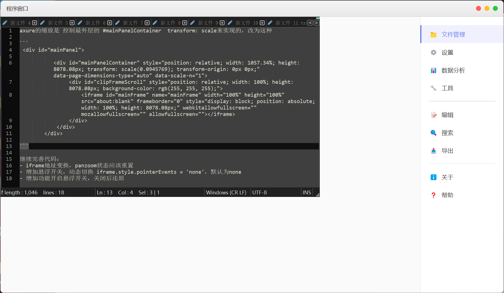
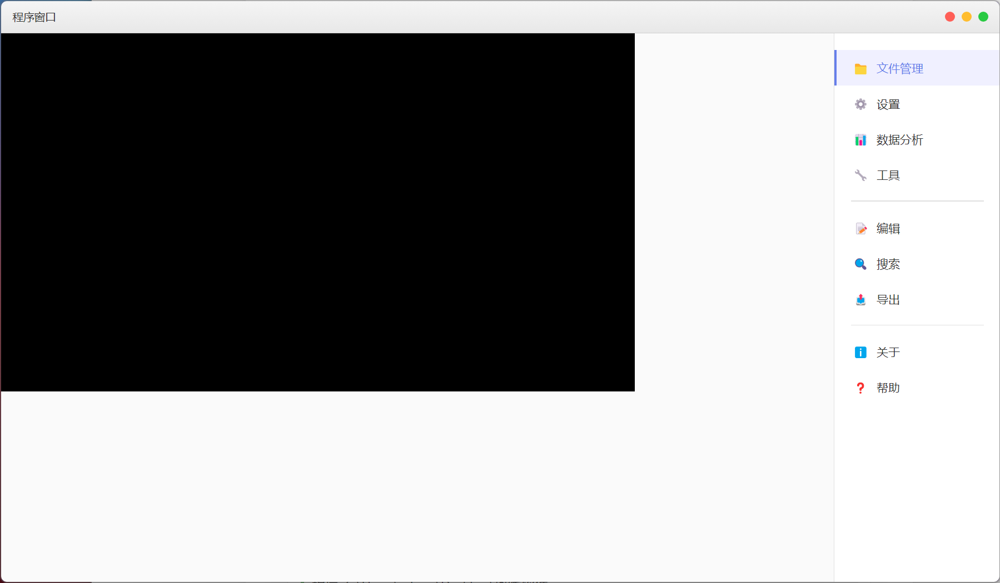

[中文文档](./REDME-zh.md)


# BrowserWindowTool - Embedding Windows Application Windows in Electron

## Project Overview

BrowserWindowTool is an Electron project designed to embed other Windows applications (such as Notepad, Paint, Calculator, etc.) within an Electron application window. By leveraging Node.js native modules, this project achieves seamless integration and control of external Windows application windows within an Electron environment.

## Project Structure

```
├── binding.gyp                  # Node.js native module build config
├── electron-example             # Electron application
│   ├── blank.html               # Blank template for embedded windows
│   ├── index.html               # Main interface
│   ├── main.js                  # Electron main process
│   ├── preload.js               # Preload script
│   └── render.js                # Renderer process script
└── src                          # Native module source code
    ├── main.cc                  # N-API module entry
    ├── WindowManager.cc         # Window management implementation
    └── WindowManager.h          # Header file
```
```tip

├── release/BrowserWindowTool.node # This is the build product for nodegyp on Windows

If you don't have a Visual Studio environment, delete the binding.gyp file and copy `release/BrowserWindowTool.node` to `/build/Release/BrowserWindowTool.node`

```

## demo

vidoe

<video width="900px" height="auto" controls>
<source src="./.imgs/demo.mp4" type="video/mp4">
</video>

embed cloudmusic


embed notepad++



##  bugs 





## Core Principles

### 1. Why Native Modules Are Required

Electron, built on Chromium and Node.js, does not natively support embedding external Windows application windows. Due to incompatibilities between Chromium's rendering engine and Windows' native window management, native modules are necessary to bridge this gap.

### 2. Embedding Technology Principles

The core implementation involves the following steps:

1. **Container Window Creation**: A transparent child window (container window) is created in the Electron window to act as the "canvas" for embedding external applications.

2. **Process Initialization**: Target applications are launched using Windows API.

3. **Window Discovery**: Target application windows are identified through window enumeration.

4. **Window Embedding**: The parent window of the target application is set to the container window, effectively embedding it.

5. **Window Resizing**: Embedded windows are dynamically resized to match the container window.

### 3. Key Technical Components

#### a. GPU Acceleration Disabled

To avoid rendering conflicts, GPU acceleration is disabled with these command-line switches:

```javascript
app.commandLine.appendSwitch("in-process-gpu");
app.commandLine.appendSwitch("disable-gpu-sandbox");
app.commandLine.appendSwitch("disable-direct-composition");
app.commandLine.appendSwitch("disable-gpu");
app.commandLine.appendSwitch("no-sandbox");
```

#### b. Native Module Integration

A native module (BrowserWindowTool) using Node.js N-API provides critical functions:
- `createEmbeddedWindow`: Creates embedded windows
- `updateWindow`: Updates window properties
- `destroyWindow`: Destroys embedded windows
- `getAllWindowIds`: Retrieves all window IDs
- `cleanupAll`: Cleans up resources

#### c. Window Embedding Implementation

Key logic in `WindowManager.cc`:

```cpp
HWND WindowManager::FindAndEmbedWindow(DWORD processId, HWND containerWindow)
{
    // Window discovery loop
    HWND targetWindow = NULL;
    for (int i = 0; i < 50; ++i) {
        EnumWindowsData data = {processId, NULL};
        EnumWindows(EnumWindowsProc, reinterpret_cast<LPARAM>(&data));
        if (data.targetWindow) {
            targetWindow = data.targetWindow;
            break;
        }
        Sleep(100);
    }
    
    // Style modification and embedding
    LONG_PTR style = GetWindowLongPtr(targetWindow, GWL_STYLE);
    style = (style & ~(WS_POPUP | WS_CAPTION | WS_THICKFRAME)) | WS_CHILD;
    SetWindowLongPtr(targetWindow, GWL_STYLE, style);
    
    SetParent(targetWindow, containerWindow);
    
    // Size adjustment
    RECT rect;
    GetClientRect(containerWindow, &rect);
    SetWindowPos(targetWindow, HWND_TOP, 0, 0, 
                rect.right - rect.left, rect.bottom - rect.top, 
                SWP_SHOWWINDOW | SWP_FRAMECHANGED);
    
    return targetWindow;
}
```

#### d. Window Event Handling

Custom window procedure in `ContainerWndProc`:

```cpp
LRESULT CALLBACK WindowManager::ContainerWndProc(HWND hwnd, UINT msg, WPARAM wparam, LPARAM lparam)
{
    switch (msg) {
    case WM_SIZE:
        // Size adjustment logic
        return 0;
    case WM_NCCALCSIZE:
        return 0;
    }
    return DefWindowProcW(hwnd, msg, wparam, lparam);
}
```


## Key Interaction Flow

1. **Container Window Creation**:
   - Electron creates transparent container window
   - Retrieves native window handle

2. **Native Module Invocation**:
   - IPC communication transfers window handle
   - Native module creates container window
   - Launches target process
   - Embeds discovered window

3. **Window Management**:
   - IPC interface controls window lifecycle
   - Native module maintains window state

## Technical Challenges & Solutions

### 1. Window Z-Order Issues

**Solution**: 
```cpp
SetWindowPos(targetWindow, HWND_TOP, ...);
BringWindowToTop(targetWindow);
```

### 2. Window Style Compatibility

**Solution**: 
```cpp
// Modified window style
style = (style & ~(WS_POPUP | WS_CAPTION | WS_THICKFRAME)) | WS_CHILD;
```

### 3. Dynamic Resizing

**Solution**:
```cpp
case WM_SIZE:
    SetWindowPos(childWindow, NULL, 0, 0, 
                rect.right - rect.left, rect.bottom - rect.top, 
                SWP_NOZORDER | SWP_NOACTIVATE);
```

## Important Considerations

1. **Windows-Only**: Relies on Windows API
2. **Native Applications**: Only supports Windows-native applications
3. **Style Customization**: May require special handling for different apps
4. **Performance**: Resource-intensive applications may impact performance
5. **Security**: Disabled security features require trusted environments

### refer

[xland/ElectronGrpc: Electron comunicate with native process by grpc](https://github.com/xland/ElectronGrpc)